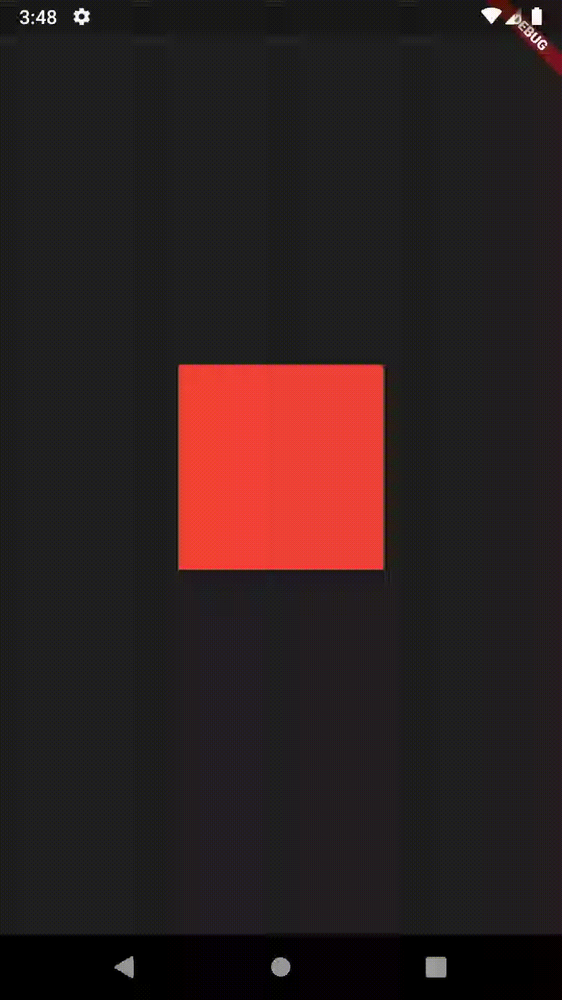

# SimpleCode

### Simple Billing
SimpleBilling extracted for its own package: https://pub.dev/packages/simple_billing

### Simple RateMyApp
SimpleRateMyApp extracted for its own package: https://pub.dev/packages/simple_rate_my_app

## Utils Widgets
ExpandedText
```dart
ExpandedText(
  'data',
  minFontSize: 2,
),
```
ExpandedIcon
```dart
ExpandedIcon(
  Icons.wifi,
),
```
AnimatedButton  


```dart
AnimatedButton(
  onTap: () {},
  scale: 1.3,
  angle: 30,
  offset: Offset(0, -50),
  opacity: 0.5,
  child: Container(
    width: 150,
    height: 150,
    color: Colors.red,
  ),
),
```

AnimatedTween  


```dart
AnimatedTween(
  offset: Offset(450, 0),
  scale: 4.5,
  angle: 250,
  delay: Duration(milliseconds: 1000),
  child: Container(
    width: 150,
    height: 150,
    color: Colors.red,
  ),
),
```

## Simple Responsivity
Responsivity izier  
wsz = size in relation to prototype Width  
hsz = size in relation to prototype Height  
sz = best between wsz and hsz  
```dart
Container(
    width: wsz(150),
    height: hsz(150),
    color: Colors.red,
),
```

You can change the standard screen size:  
640 (height) and 360 (width) are the default Android screen size in Adobe XD.  
Change this to the screen size used in the prototype.  
```dart
SimpleCode.changeEmulatorSize(heigth: 640, width: 360);
```

## Simple Navigator
Navigator withoutContext and builder
```dart
SimpleCode.navigator.push(SimpleRoute.cupertino(Page()));
SimpleCode.navigator.pushNamed('/nextPage');
SimpleCode.navigator.showDialog(
  widget: Dialog(),
  withBlackBackground: false,
  barrierDismissible: false,
);
```

Navigator withCustomTransitions  


```dart
SimpleCode.navigator.push(SimpleRoute.custom(
  NewPage(),
  curve: Curves.easeOutBack,
  duration: Duration(milliseconds: 600),
  transitions: [
    Transition.slideFromTop,
    Transition.slideFromRigth,
  ],
));
enum Transition {
  fadeIn,
  slideFromBottom,
  slideFromRigth,
  slideFromLeft,
  slideFromTop,
  zoomIn,
}
```

## Simple Utils
```dart
SimpleUtils.isDev
SimpleUtils.internetConnection
SimpleUtils.enumValueString
```


# Getting Started

```dart
return MaterialApp(
    navigatorKey: SimpleCode.navigatorKey,
    home: MyApp(),
);
``` 

or 

```dart
SimpleCode.changeNavigatorKey(externalKey);
return MaterialApp(
    navigatorKey: externalKey,
    home: MyApp(),
);
``` 
